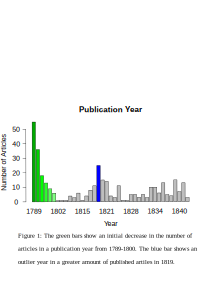

# Notes for Week Five

<iframe src="https://uploads.knightlab.com/storymapjs/9bec84c4afc3fb203dcc2ddf177a566f/the-creation-of-nadia/index.html" frameborder="0" width="100%" height="800"></iframe>

I did the example in Inkscape

And then I made my own based on a term paper I wrote for a history course I took last year (HIST 2304)
The paper can be found here:
https://github.com/rachelnadia/week-five/blob/master/Morgan2304FinalPaper.docx

